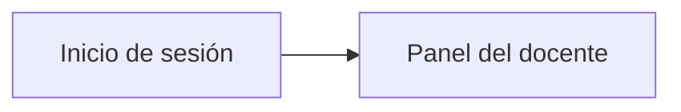
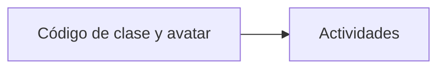

# Flujo de usuario

Pantallas y transiciones de cada rol, en Mermaid.

## Docente

```mermaid
flowchart LR
    A[Inicio de sesión] --> B[Panel del docente]
```

## Niño

```mermaid
flowchart LR
    A[Código de clase y avatar] --> B[Actividades]
```
